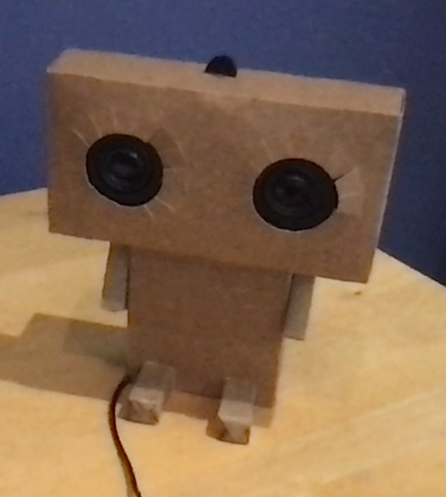

# P.A.L - My personal assistant lifeform

This is a holiday project for my school.

- McDonald Drink Holders
- Speakers
- Microphone
- Raspberry Pi computer

Python is used as programming language.

We used 2 online cources and combined the elements to make P.A.L behave the way we wanted.

